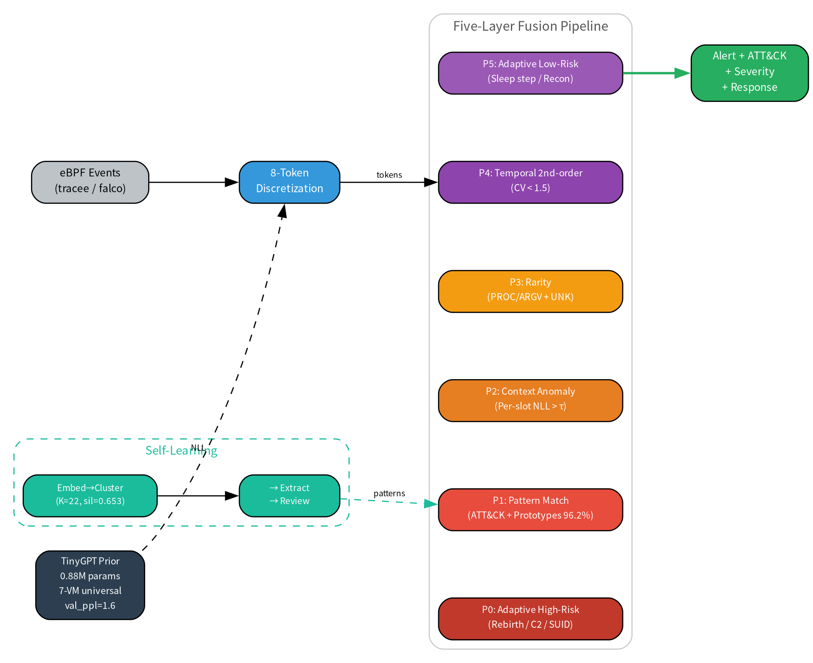

# Siming — Behavioral Grammar Detection Engine

**Behavioral Grammar: Detecting Adaptive Malware via Tiny Language Model Priors and Second-Order Temporal Analysis**

[](LICENSE)
[]()
[]()
[]()

<p align="center"><b>Zhiyan Security Lab</b></p>

---

## What is Siming?

Siming is a host-based intrusion detection system that treats runtime behavior as a **structured language** and learns its "grammar" with a compact 0.88M-parameter causal Transformer (TinyGPT).

Each system event is discretized into an **8-token representation**:

```
ET:EXEC  PROC:bash  ARGV:N1P  PC:NONE  PARENT:sshd  UID:1000  DST:NONE  DT3
```

The model learns the conditional distribution of normal behavior in a purely self-supervised manner. Anomaly scores are derived from per-slot negative log-likelihood (NLL) statistics, and each alert names the exact slot that violated the grammar — restoring the auditability that monolithic sequence models sacrifice.

<p align="center">
  
</p>

## Architecture: Five-Layer Fusion

| Layer | Function | Priority |
|-------|----------|----------|
| **P0** | Adaptive high-risk patterns (morphological transformation, disguised C2, SUID privesc) | Critical |
| **P1** | ATT&CK pattern matching + prototype network (96.2% leave-one-out) | High |
| **P2** | Per-slot context anomaly (NLL > τ for PARENT/DST/DT) | Medium |
| **P3** | Token rarity + unknown token detection | Medium |
| **P4** | **Second-order temporal analysis** (CV < 1.5 = machine cadence) | **Strongest signal** |
| **P5** | Adaptive low-risk patterns (sleep stepping, recon uniformity) | Low |

## Key Results

| Metric | Value |
|--------|-------|
| Detection rate vs adaptive agent | **93%** |
| Onboarding FPR (p99.5) | **3.84%** |
| Cross-host FPR (7 VMs avg) | **3.4%** |
| Temporal CV separation | **0.31 vs 9.79** (30×) |
| ATT&CK techniques covered | 14 (expanding to 50+) |
| Model size | 0.88M params (3.6 MB) |
| Inference | CPU real-time (<1 ms per event) |

## Quick Start

```bash
# 1. Install dependencies
pip install torch numpy scikit-learn pyyaml

# 2. Check environment and files
python3 detector/deploy_siming.py install

# 3. Initialize: extract tokens from a tracee JSONL log and calibrate slot τ
#    (20 min of benign telemetry is enough)
python3 detector/deploy_siming.py init /path/to/tracee.jsonl

#    (alternative: calibrate the shipped universal model on your own baseline)
python3 detector/onboard_v2.py models/vm-universal data/onboard_benign.jsonl

# 4. Start the detection daemon against a live tracee stream
python3 detector/deploy_siming.py start --src /path/to/tracee.jsonl

# 5. Check status and alerts
python3 detector/deploy_siming.py status
```

The pre-trained 7-VM universal model in `models/vm-universal/` is found automatically — no path configuration needed.

## Project Structure

```
siming/
├── detector/                 # Core detection code
│   ├── train_prior.py        # TinyGPT training (0.88M params)
│   ├── deploy_scorer.py      # Five-layer fusion scoring daemon
│   ├── temporal_analyzer.py  # Second-order temporal CV analysis
│   ├── adaptive_detector.py  # Adaptive behavior patterns
│   ├── pattern_db.py         # Pattern matching engine
│   ├── proto_head.py         # Prototype learning (contrastive)
│   ├── auto_pattern.py       # Self-learning pattern extraction
│   ├── parse_events.py       # Token discretization (8-token)
│   ├── parse_raw_tracee.py   # Tracee JSONL → tokens
│   ├── onboard_v2.py         # Auto-calibration (p95→p99 fallback)
│   ├── deploy_siming.py      # One-click deployment CLI
│   ├── collect_atomic.py     # Atomic Red Team collection
│   ├── calibrate_vm_tau.py   # Cross-host τ calibration
│   ├── patterns.jsonl        # Pattern library (99 entries)
│   ├── prototypes.jsonl      # Prototype codebook (14 techniques × 3 prototypes, ~150 KB)
│   └── ...                   # Tests, eval scripts, utilities
├── models/
│   └── vm-universal/         # Pre-trained 7-VM universal model
│       ├── prior.pt          # 3.6 MB TinyGPT weights
│       ├── slot_tau_local.json  # Calibrated thresholds (p99.5)
│       └── slot_tau_vm.json     # VM baseline thresholds
├── data/
│   ├── experiment_results.json    # Evaluation results
│   └── experiment_data_summary.md # Full experiment data summary
└── docs/
    ├── paper_behavioral_grammar_detection.md  # Full paper
    └── fig*.png/pdf           # Paper figures (8 figures)
```

## Training Your Own Model

```bash
# Collect benign telemetry from your hosts
# Format: {"tokens": ["ET:EXEC","PROC:bash",...8 tokens...]} per line

# Train TinyGPT (~3 min on H800 GPU, ~11 min on CPU)
python3 detector/train_prior.py data/your_benign.jsonl models/your-model

# Calibrate thresholds
python3 detector/onboard_v2.py models/your-model data/your_benign.jsonl

# Evaluate
python3 detector/test_e2e_v3.py
```

## Self-Learning Pipeline

```bash
# Automatically discover attack patterns from labeled sequences
python3 detector/auto_pattern.py models/vm-universal --from-patterns

# Output: data/auto_patterns_candidates.jsonl (pending human review)
# Review → approve → append to detector/patterns.jsonl → retrain prototypes
```

## Atomic Red Team Collection

> ⚠️ **Run only in isolated, dedicated test environments.** These scripts
> execute real attack *test* commands from the public Atomic Red Team library
> (with cleanup) to collect labeled telemetry. Never run them on production
> or shared machines.

```bash
# Install Atomic Red Team framework
sudo python3 detector/collect_atomic.py                      # Full collection (~600 techniques)
sudo python3 detector/collect_atomic.py --technique T1053.003  # Single technique
python3 detector/collect_atomic.py --list-only               # List available tests
```

## Reproducing the Paper Experiments

All experiment data is documented in [`data/experiment_data_summary.md`](data/experiment_data_summary.md):

```bash
# Ablation + τ sweep + synthetic + cross-host
python3 detector/supplementary_experiments.py

# End-to-end pipeline test (11 ATT&CK attack/cleanup/verify triples)
python3 detector/test_e2e_v3.py
```

## Citation

```bibtex
@misc{siming2026,
    title={Behavioral Grammar: Detecting Adaptive Malware via Tiny Language Model Priors and Second-Order Temporal Analysis},
    author={Zhiyan Security Lab},
    year={2026},
    note={arXiv preprint, cs.CR}
}
```

## License

Apache License 2.0 — see [LICENSE](LICENSE).

## Threat Model

This system is designed to detect **adaptive adversarial agents** — malware that learns survival strategies from defensive feedback. The threat model is described at the abstraction level only. Specific offensive implementation details are not included in this release.

## Acknowledgments

- MITRE ATT&CK framework for technique taxonomy
- Aqua Security Tracee for eBPF-based telemetry
- CNCF Falco for runtime security rules
- Atomic Red Team for standardized attack simulations
